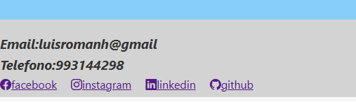

# product-landing-page

Modulo 1 -lab01 - Lab02 -Lab03 - Lab04

1. Explica la estructura semántica que elegiste y justifica tus etiquetas.

mi proyecto es un portafolio personal y profesional explicare rapidamente su estructura 💯
se utiliza estructura semantica en resumen:

```html
<!DOCTYPE html>
<html lang="es">
  <head>
    ...
  </head>
  <body>
    <header>...</header>
    <main>...</main>
    <section>..</section>
    <article>..</article>
    <footer>...</footer>
  </body>
</html>
```

header: Encabezado del sitio que contiene elementos introductorios o de navegación.
nav: Define el bloque de navegación principal. Aunque es válido tener navegación fuera del <header>, aquí tiene sentido porque está al inicio y contiene el logo y enlaces.
main: Representa el contenido principal del documento. Solo debe haber uno por página y no debe incluir navegación, encabezado o pie de página.
section: Cada bloque temático está adecuadamente separado por secciones con su propio id, lo cual mejora la accesibilidad, indexación y navegación.
footer: Contenedor adecuado para la parte de enlacesa a redes y la etiqueta <address> final del documento.


2)logros adicionales:
se realizo los 2 logros adicionales
Logro 1: Implementar un Modo Oscuro (Dark Mode)
(se implemento un boton en el nav y tmb una funcionalidad dark-mode en javascript que hace que al precionar el icono de noche , trae los estilos
configurados en el css con el backgrond en negro y color blanco para el body

Logro 2: Microinteracciones y Transiciones
se hizo un hover para los item del nav, que al pasar poner los colores en azul


2)Incluye el prompt usado con la IA y describe cómo validaste la respuesta.

Prompt Engineering
Generar al menos un prompt para la IA solicitando sugerencias sobre la estructura semántica.


respuestas:


Explicar los ajustes manuales que le hiciste a la propuesta de la IA para garantizar accesibilidad.

*me ayudo en el parte de proyectos cambiar un div en general, por poner un article a cada proyecto para mejorar la estructura y legibilidad:
*en el footer poner la informacion del email y telefono entre otros dentro de un address y ya no un div

# LAB02

se integro lo mencionado ,design responsive, display flex , como la seccion de testimonios y transiciones


# LAB03


se integro el display grid mencionado y y los logros adicionales como el boton de whatsaap y mensaje de contacto


# LAB04


Se integro bootsratp para los componentes de botones y en el footer los links a redes sociales

